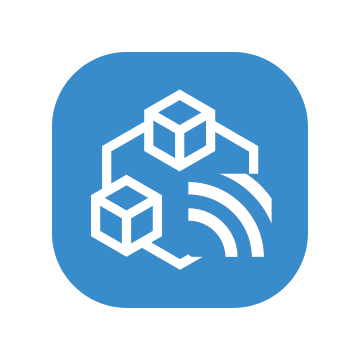

<div align="center">
  
  <h1>trpc-mqtt</h1>
  <a href="https://www.npmjs.com/package/trpc-mqtt"></a>
  <a href="https://github.com/edorgeville/trpc-mqtt/actions/workflows/test.yml"></a>
  <a href="./LICENSE"></a>
  <br />
  <hr />
</div>


## Usage

**1. Install `trpc-mqtt`.**

```bash
# npm
npm install trpc-mqtt mqtt@5
# yarn
yarn add trpc-mqtt mqtt@5
# pnpm
pnpm add trpc-mqtt mqtt@5
```

**2. Use `mqttLink` in your client code.**

```typescript
import { createTRPCProxyClient } from '@trpc/client';
import { mqttLink } from 'trpc-mqtt/link';
import mqtt from 'mqtt';

import type { AppRouter } from './appRouter';

const client = mqtt.connect('mqtt://localhost');

export const trpc = createTRPCProxyClient<AppRouter>({
  links: [
    mqttLink({
      client,
      requestTopic: "rpc/request"
    })
  ],
});
```

Note: don't forget to clean up the MQTT client when you're done, using `client.end()`.

**3. Use `createMQTTHandler` to handle incoming calls via mqtt on the server.**

```typescript
import { createMQTTHandler } from 'trpc-mqtt/adapter';

import { appRouter } from './appRouter';

const client = mqtt.connect('mqtt://localhost');

createMQTTHandler({ 
  client,
  requestTopic: "rpc/request",
  router: appRouter
});
```

Note: same as with the link, don't forget to clean up the MQTT client when you're done, using `client.end()`.

## License

Distributed under the MIT License. See LICENSE for more information.

## Special thanks
This project is a fork of [trpc-rabbitmq](https://github.com/imxeno/trpc-rabbitmq) by [Alex Brazier](https://github.com/imxeno)
